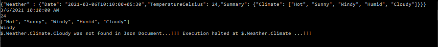

# Aries
Json Path Library in C# using System.Text.Json Library in .NET 5.0 with dotted decimal notation for the JsonPath.

## What is Aries?
Aries as we all know is the name of the Zodiac Sign symbolizing the Ram. (Male Sheep)

## What is it's significance?
Aries is a central theme to the story of the legend of the Golden Fleece. It is the Fleece (skin) of Chrysomallos which is the source of the Quest for it in the famous story of Jason & the Argonauts.

## Who is Jason & who are the Argonauts?
Jason is one of the famous Greek Heroes, who along with 50 other brave men (Including Pollux & Castor ... the Gemini Twins and Hercules whom we all know and have heard of ...) of Greece set sail on Argo (the ship ... and a constellation now...) in the Quest for the Golden Fleece.

## So now we know who Jason is ... how's  this connected to this Computer Project?
Jason is a homophone for JSON and hence this nomenclature and name for this project.<br> Aries being the central theme capturing the Journey of Jason OR the Path of JSON as you may wish to call in this project.

## Okay ... so what is JSON?
JSON stands for JavaScript Object Notation. It is a very popular data storage and exchange format for the Web and now Desktop, Mobile and Cloud as well ....

## Hmmm ... how does JSON look like?
JSON Document looks like below:
```
{
  "Weather" : {
    "TemperatureCelsius" : 24,
    "Humidity" : 79.6,
    "Forecast" : ["Sunny", "Cloudy", "Windy", "Hot", "Humid", "Cool", "Partly Cloudy"]
  }
}
```  

## That looks pretty!! But it's all Greek to me!!!! ......
Okay. There are basically 2 parts to a JSON Document.
1. The Keys
2. The Values
The Keys are the ones on the left hand side of the : character!
The Values on the right!

## Okay ... so what's the deal with Keys & Values?
Keys will always be used to refer to the values!<br>
i.e. they will be the source for lookup of any values in the JSON Document or Dictionary as you may call it!

## Hmmm ... so what values are permitted in Keys & Values?
That's a great question!<br>
Keys are normally only Strings!<br>
However, Values may be of 2 broad classes or types ....
1. Objects
2. Arrays <br/>
<br>
Objects are complex structures of combination of basic types!<br>
They are denoted by the { } symbol. <br/>
Arrays are collections of Objects or Basic Types! <br/>
They are denoted by the [ ] symbol.

## Interesting ... so what are JSON Documents used for?
For a wide variety of purposes! <br/>
In Web APIs like REST Services on the Web ... they are the de-facto for Requests & Response Types! <br>
In .NET 5.0 they are used as containers for Project Type Files! <br>
And more ....!!!!

## Hmmm .... So what can we do with a Json?
Well, you can Parse it .... <br>
Traverse it ... <br>
Read it ... <br>
Write to it ... <br>
And more ... <br>

## That's pretty cool!!! So what does this Project deal with now?
The Parsing part .... <br>
And more importantly ... the Traversal!!!! <br>

## Hmmm ... Okay can you please elaborate?
Here's how Traversal Works .... <br>
Consider the JSON Document as follows ... <br>
```
{
  "Weather" : {
    "TemperatureCelsius" : 24,
    "Humidity" : 79.6,
    "Forecast" : ["Sunny", "Cloudy", "Windy", "Hot", "Humid", "Cool", "Partly Cloudy"]
  }
}
```
Say, we want to access the value of the TemperatureCelsius field ... i.e in terms of Business ... the Temperature in the Weather .... <br>
How do we do it? <br>
Simple,  we use the Dotted Decimal Notation!!! <br>

## So what's the Dotted Decimal Notation?
It's used in Books in Libraries & also in the IP Addresses of Computers on the Net!!!

## Okay ... how does that look for the Weather JSON?
Simple, say you want to access the Temperature .... <br>
Here's how you would do it ... <br>
We would start with a $ symbol to specify the Root Element of the Document ... <br>
Then simply use Dots to traverse the Document's Keys in the Hierarchical Order!! <br>
So for the Document Below ... <br>
```
{
  "Weather" : {
    "TemperatureCelsius" : 24,
    "Humidity" : 79.6,
    "Forecast" : ["Sunny", "Cloudy", "Windy", "Hot", "Humid", "Cool", "Partly Cloudy"]
  }
}
```
To access TemperatureCelsius we would simply write .... <br>
$.Weather.TemperatureCelsius <br>
In case we want to access an Array ... <br>
Say Windy ... <br>
We would simply Write .... <br>
$.Weather.Forecast[2] <br>
Keeping in mind that Array Indices start from 0. <br>

## Alright! That's pretty Cool! And Clears up a lot of things!!!
Yup! So basically ... <br> JSON Documents support a number of different Value types .... <br>
Like ... <br>
1. Numeric
2. Strings
3. Integers
4. Doubles or Floats
5. Bytes
6. Characters
etc...

## So, why is JSON So Popular?
Because, it is Lightweight! <br>
Doesn't have those messy Tags Or Attributes that XML for instance .... carries with it!!! <br>
And is Easily Serializable and Deserializable!!! <br>
Easy to read & interpret!!! <br>
Lot of Libraries and Support on the Net <br>
Become the default standard for data representation and exchange on the Internet <br>
And more .... <br>

## Cool! So what does this Project structure Look Like?
It is a Library to Parse and Traverse a JSON easily using the JSON Path having Dotted Decimal Notation!!! <br>
The Solution is Composed of the following Projects .... <br>
1. Aries -> Consumer of the Library for JsonPath and has the main method in C# in the Program.cs ... the entry point into the Program!!!<br>
2. JsonPath -> The Actual Library doing the heavy lifting of Parsing & Traversal of the Json Document!!! <br>
3. JsonPathTests -> Tests for the JsonPath Library!!! Is using NUnit 3!!!! <br>

## Excellent!! So, what next?
Explore & Find Your Own Path!!! <br>
Feel free to browse through the code and go through it in detail!!!! <br>
Try to Extend or Customize the Functionality of this Solution & Project and add more capabilities & cool features to it!!! <br>

## Just to Get You Started!!! A Glimpse of the Output ... !!!!


## That's a Wrap!!!!
So, with this we come to an end of the discussion of JsonPath & the role Aries plays to facilitate it!! <br>
So, tinker & play with the code and find your own Path!!! <br>
With that .... <br>
Happy Coding!!! <br>

                                          --Bhaskar Rao.
